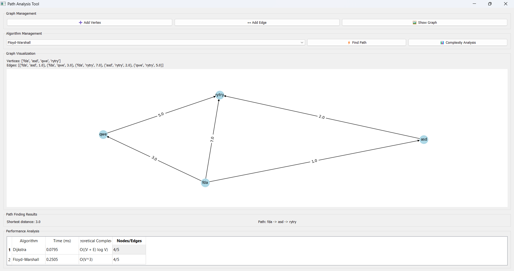

# Graph Path Analysis Tool

A comprehensive PyQt5-based application for analyzing shortest path algorithms on directed graphs. This tool provides an interactive interface for creating graphs, visualizing them, and comparing the performance of various shortest path algorithms.

<p align="center">
  
</p>
<p align="center">
  <i>UI of the program</i>
</p>

## 🚀 Features

### Supported Algorithms
- **Dijkstra's Algorithm** - O((V + E) log V)
- **Bellman-Ford Algorithm** - O(V × E)
- **Floyd-Warshall Algorithm** - O(V³)
- **Johnson's Algorithm** - O(V² log V + V×E)
- **Levit's Algorithm** - O(V × E) average case
- **Yen's K-Shortest Paths** - O(K×V×(E + V log V))

### Key Capabilities
- ✅ Interactive graph creation and editing
- ✅ Real-time graph visualization
- ✅ Performance benchmarking and comparison
- ✅ Support for negative edge weights (where applicable)
- ✅ Negative cycle detection
- ✅ Comprehensive algorithm analysis
- ✅ User-friendly GUI interface

## 🛠️ Installation

### Method 1: Clone Repository
```bash
git clone https://github.com/yourusername/graph-path-analyzer.git
cd graph-path-analyzer
pip install -r requirements.txt
```

### Method 2: Direct Download
1. Download the `graph_analyzer.py` file
2. Install dependencies:
```bash
pip install PyQt5 matplotlib networkx
```

## 🎯 Usage

### Running the Application
```bash
python graph_analyzer.py
```

### Quick Start Guide

#### 1. Create a Graph
- Click **"Add Vertex"** to add nodes to your graph
- Click **"Add Edge"** to connect vertices with weighted edges
- Use **"Show Graph"** to visualize your current graph

#### 2. Find Shortest Paths
- Select an algorithm from the dropdown menu
- Click **"Find Path"** to execute the selected algorithm
- Choose start and end vertices when prompted
- View results in the "Path Finding Results" section

#### 3. Performance Analysis
- Click **"Complexity Analysis"** to run all algorithms
- Compare execution times and theoretical complexities
- Results are displayed in the performance table

### Example Workflow
```
1. Add vertices: A, B, C, D
2. Add edges: A→B (weight: 5), B→C (weight: 3), A→C (weight: 8), C→D (weight: 2)
3. Select "Dijkstra" algorithm
4. Find path from A to D
5. Result: Distance = 10, Path = A → B → C → D
```

## 📊 Algorithm Details

### Dijkstra's Algorithm
- **Best for**: Graphs with non-negative edge weights
- **Time Complexity**: O((V + E) log V)
- **Space Complexity**: O(V)
- **Features**: Optimal for single-source shortest paths

### Bellman-Ford Algorithm
- **Best for**: Graphs with negative edge weights
- **Time Complexity**: O(V × E)
- **Space Complexity**: O(V)
- **Features**: Detects negative cycles

### Floyd-Warshall Algorithm
- **Best for**: All-pairs shortest paths
- **Time Complexity**: O(V³)
- **Space Complexity**: O(V²)
- **Features**: Finds shortest paths between all vertex pairs

### Johnson's Algorithm
- **Best for**: All-pairs shortest paths with negative edges
- **Time Complexity**: O(V² log V + V×E)
- **Space Complexity**: O(V²)
- **Features**: Combines Bellman-Ford and Dijkstra

### Levit's Algorithm
- **Best for**: Graphs with mixed edge weights
- **Time Complexity**: O(V × E) average case
- **Space Complexity**: O(V)
- **Features**: Efficient modification of Bellman-Ford

### Yen's K-Shortest Paths
- **Best for**: Finding multiple shortest paths
- **Time Complexity**: O(K×V×(E + V log V))
- **Space Complexity**: O(V)
- **Features**: Finds K shortest loopless paths

<p>
  <i>fait avec amour <3</i>
</p>
